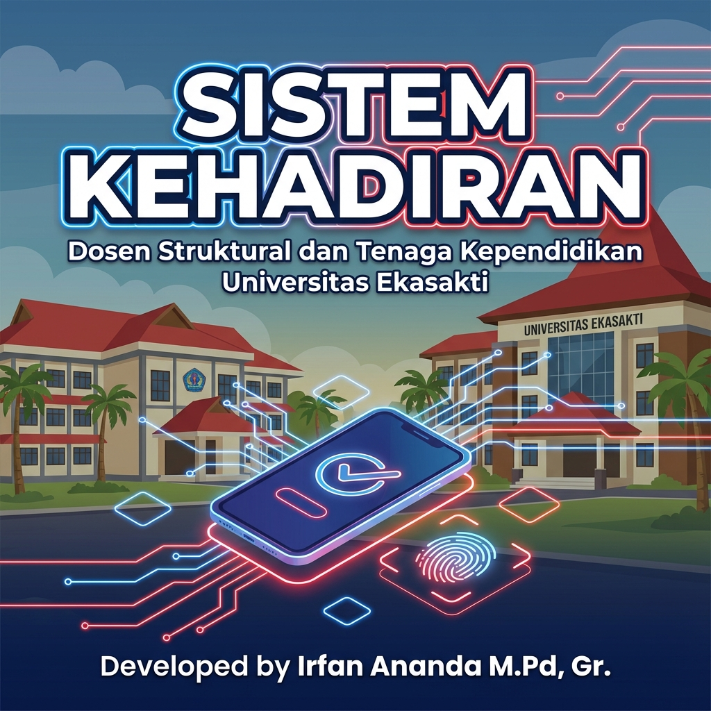

<div align="center">



# UNES-Hebat — Sistem Informasi Manajemen Kehadiran

Aplikasi absensi online untuk **Dosen Struktural & Tenaga Kependidikan Universitas Ekasakti**:
absensi masuk/pulang berbasis **GPS (geofencing)** + **foto bukti** + **server-time**,
dilengkapi izin/cuti/dinas luar, laporan PDF, dan notifikasi Telegram.

**Web (PWA-friendly) • Android & iOS via Capacitor • Backend Supabase**

</div>

---

## ✨ Fitur Utama

| Area | Keterangan |
|---|---|
| 🕐 Absensi masuk & pulang | Clock-in/out dengan validasi jam kerja (mendukung jadwal custom per user) |
| 📍 Geofencing GPS | Validasi lokasi Haversine + radius per titik; lokasi primer & sekunder |
| 🤳 Bukti foto | Selfie/foto wajib tiap absensi, tersimpan di Supabase Storage |
| ⏱️ Server-time hardening | Validasi & insert via Supabase RPC (`submit_attendance_server_time`, zona `Asia/Jakarta`) — jam HP tidak bisa dimanipulasi |
| 🛡️ Anti fake-GPS | Deteksi mock location (Android) + flag bypass per user |
| 🏖️ Izin, cuti, dinas luar | Pengajuan + persetujuan admin |
| 📅 Hari libur & jam kerja | Kalender libur nasional + jam kerja custom |
| 📄 Laporan PDF | Rekap individu & rekapitulasi (jsPDF + autotable), termasuk lampiran foto |
| 🔔 Notifikasi Telegram | Bukti absensi terkirim ke Telegram via backend (token aman, tidak di frontend) |
| 👥 Manajemen pengguna | Role (superadmin/admin/dosen/pegawai), blokir akses, revoke sesi |
| 📊 Dashboard & peta | Statistik kehadiran + mapping titik absen |

## 🧰 Tech Stack

- **Frontend:** React 18 + TypeScript + Vite 6 + Tailwind CSS + shadcn/ui (Radix UI)
- **State/Data:** TanStack React Query + React Router + React Hook Form + Zod
- **Backend:** Supabase (PostgreSQL, custom RPC, RLS, Storage, Edge Functions)
- **PDF:** jsPDF + jspdf-autotable
- **Mobile:** Capacitor 7 (Android & iOS, `webDir: dist`)
- **Deploy web:** Cloudflare Pages (lihat `vercel.json` untuk contoh rewrite API)

## 🚀 Quickstart (5–10 menit)

### 1. Prasyarat

- Node.js 20+ dan [pnpm](https://pnpm.io) (`npm i -g pnpm`)
- Akun + project [Supabase](https://supabase.com) (gratis cukup untuk mulai)
- (Opsional) Bot Telegram untuk notifikasi bukti absensi

### 2. Install & jalan lokal

```bash
git clone https://github.com/ivankazzzz/UNES-Hebat.git
cd UNES-Hebat
pnpm install
cp .env.example .env
pnpm dev
```

Buka `http://localhost:5173`.

### 3. Konfigurasi environment

Salin `.env.example` ke `.env`, lalu isi:

| Variabel | Wajib | Keterangan |
|---|---|---|
| `VITE_SUPABASE_URL` | ✅ | URL project Supabase |
| `VITE_SUPABASE_ANON_KEY` | ✅ | Anon key (aman untuk frontend **asal RLS benar**) |
| `VITE_ENABLE_TEACHING_ATTENDANCE` | — | `true` untuk memunculkan menu Absensi Mengajar |
| `VITE_ATTENDANCE_TELEGRAM_CHAT_ID` | — | Chat ID tujuan bukti absensi |
| `TELEGRAM_BOT_TOKEN` | — | Token bot (backend/Edge Function saja!) |
| `TELEGRAM_TARGET_CHAT_ID` | — | Chat tujuan backend |
| `VITE_TELEGRAM_BOT_TOKEN` | — | Token yang sama, untuk ambil foto di PDF |

> ⚠️ Jangan pernah menaruh `SUPABASE_SERVICE_ROLE_KEY` atau token bot di kode frontend.
> Lihat [SECURITY.md](SECURITY.md).

### 4. Siapkan database Supabase

> 📌 Repo ini belum menyertakan file migrasi SQL otomatis — skema dibuat sekali via
> SQL Editor Supabase. Tabel & RPC yang dibutuhkan aplikasi:

**Tabel utama:** `users`, `attendances`, `attendance_locations`, `leave_permits`,
`holidays`, `campus_buildings`, `user_passwords`, `user_work_schedules`.

**RPC penting:**

- `verify_user_password` — login (auth custom di atas PostgreSQL, bukan Supabase Auth)
- `submit_attendance_server_time` — insert absensi dengan waktu server `Asia/Jakarta`
  (end-minute inklusif sampai detik `:59`)

Referensi tipe lengkap: [`supabase_types.ts`](supabase_types.ts).
Aktifkan **Row Level Security (RLS)** di semua tabel operasional sebelum go-live —
pola yang disarankan: SELECT boleh longgar, INSERT/UPDATE/DELETE dibatasi pemilik data & role.

### 5. Build & preview produksi

```bash
pnpm build
pnpm preview
pnpm lint
```

## 📁 Struktur Folder

```
src/
  pages/        # Login, Attendance, Admin, Rekap, Laporan*, History, Profile, ...
  components/   # Layout, BottomNavigation, ProtectedRoute, ui/* (shadcn)
  lib/          # auth.ts (custom auth), supabase.ts, supabase-helpers.ts, pdf-*
  hooks/ utils/
api/            # Serverless endpoint Telegram (telegram-evidence, telegram-photo)
functions/      # Supabase Edge Functions terkait
supabase/       # Konfigurasi/ref project Supabase
android/ ios/   # Project native Capacitor
public/         # Aset statis
```

Detail alur & catatan teknis internal: [`AGENTS.md`](AGENTS.md).

## 📱 Build Mobile (Capacitor)

```bash
pnpm build
npx cap sync
npx cap open android   # / ios
```

## 🤝 Kontribusi

Sangat terbuka untuk kampus/komunitas lain yang mau mengadopsi! Baca
[CONTRIBUTING.md](CONTRIBUTING.md) sebelum bikin PR. Bug & ide fitur via
[Issues](../../issues) (template tersedia).

## 🔒 Keamanan

Menemukan celah keamanan? **Jangan** buka issue publik — baca [SECURITY.md](SECURITY.md).

## 📜 Lisensi

Belum ditentukan — hubungi pemilik repo untuk penggunaan di luar evaluasi/pembelajaran.
(// TODO: pilih lisensi open source, mis. MIT.)

## 🙏 Kredit

Dikembangkan untuk **Universitas Ekasakti (UNES-AAI)**.
Dibangun di atas proyek open source: React, Vite, Tailwind CSS, shadcn/ui, Supabase, Capacitor, jsPDF.
</div>
